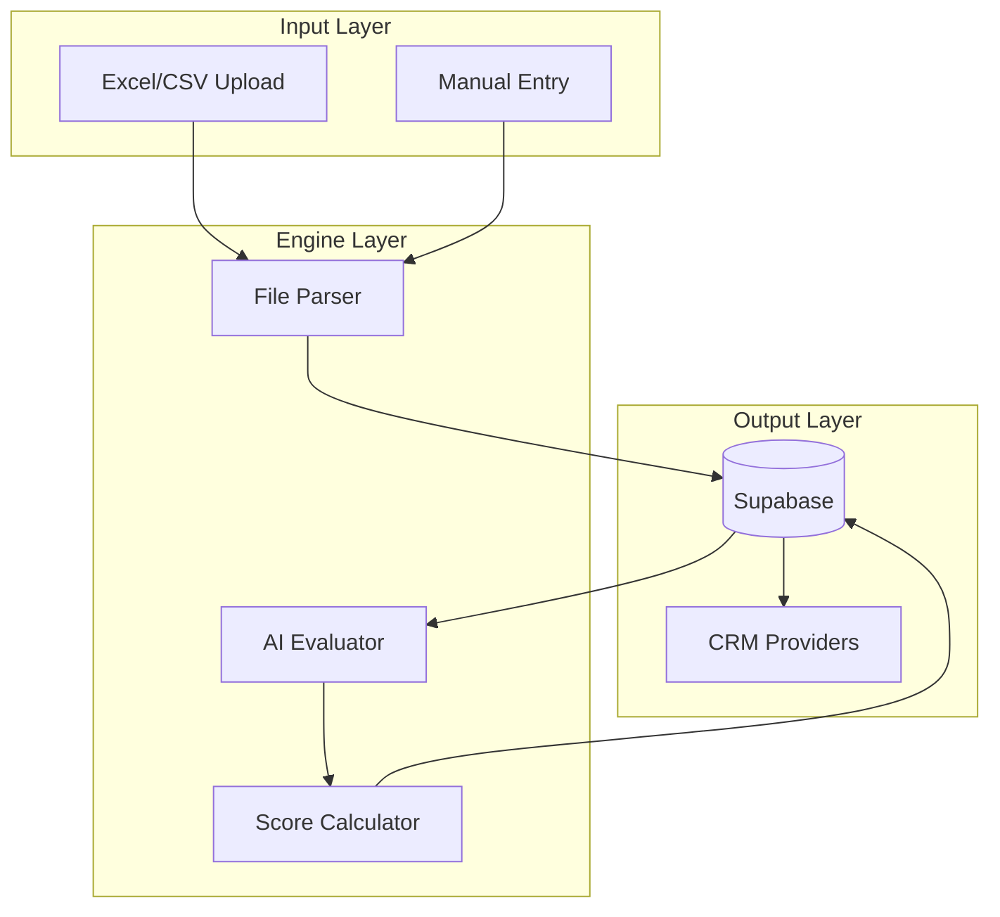

# Etmaam CRM Integration Tool - Implementation Plan

## Architecture Overview



## Tech Stack

- **Framework:** Next.js 16.1.4 (App Router)
- **Language:** TypeScript 5.7+ (strict mode)
- **Styling:** Tailwind CSS 4.0 with RTL support
- **UI:** Shadcn/UI components
- **Database:** Supabase (PostgreSQL + Auth + RLS)
- **AI:** DeepSeek (primary) + OpenAI + Anthropic (configurable)
- **i18n:** next-intl (Arabic default, English secondary)

---

## Phase 1: Foundation (Tasks 1-6)

### Task 1: Project Initialization

Create the Next.js 16 project with all dependencies.

**Key Files:**

- `package.json` - Dependencies including DeepSeek SDK
- `next.config.ts` - App Router + Server Actions config
- `tsconfig.json` - Strict TypeScript
- `.env.local.example` - Environment template

**Dependencies to install:**

```
next react react-dom next-intl next-themes
@supabase/ssr @supabase/supabase-js
ai @ai-sdk/openai
lucide-react zod date-fns papaparse xlsx
clsx tailwind-merge react-dropzone
```

### Task 2: Tailwind CSS 4 + RTL Setup

Configure styling with Arabic-first RTL support.

**Key Files:**

- `tailwind.config.ts` - Theme with emerald primary, IBM Plex Arabic font
- `app/globals.css` - CSS variables for light/dark mode
- `postcss.config.mjs` - PostCSS configuration

**RTL Strategy:** Use Tailwind logical properties (`ms-`, `me-`, `start-`, `end-`)

### Task 3: Internationalization (next-intl)

Setup Arabic (default) and English locales.

**Key Files:**

- `i18n/config.ts` - Locale configuration
- `i18n/request.ts` - Server request config
- `messages/ar.json` - Arabic translations
- `messages/en.json` - English translations
- `middleware.ts` - Locale routing middleware

### Task 4: Root Layout + Theme Provider

Create the app shell with RTL direction and theme toggle.

**Key Files:**

- `app/[locale]/layout.tsx` - Root layout with IBM Plex Sans Arabic font
- `app/[locale]/page.tsx` - Landing page
- `components/providers/theme-provider.tsx` - next-themes wrapper
- `lib/utils.ts` - cn() utility function

### Task 5: Supabase Setup

Create Supabase project and configure clients.

**Steps:**

1. Create project at supabase.com
2. Get `SUPABASE_URL` and `SUPABASE_ANON_KEY`
3. Enable Email Auth

**Key Files:**

- `lib/supabase/server.ts` - Server client (SSR)
- `lib/supabase/client.ts` - Browser client
- `.env.local` - Supabase credentials

### Task 6: Database Schema + Migrations

Create all tables with RLS policies.

**Tables:**

- `tenders` - Source tender data
- `evaluations` - AI evaluation results
- `crm_connections` - CRM provider configs
- `crm_opportunities` - Pushed records

**Key File:**

- `supabase/migrations/001_initial_schema.sql`

All tables have:

- UUID primary keys
- `user_id` foreign key to `auth.users`
- RLS enabled with user isolation policies
- Indexes on frequently queried columns

---

## Phase 2: Data Engine (Tasks 7-10)

### Task 7: Type Definitions + Zod Schemas

Define TypeScript types and validation schemas.

**Key Files:**

- `types/tender.ts` - TenderImportSchema, TenderImport type
- `types/evaluation.ts` - EvaluationResult type
- `types/crm.ts` - CRMConfig, OpportunityData types
- `types/supabase.ts` - Generated from Supabase

### Task 8: File Parser (Excel/CSV)

Build the file upload and parsing system.

**Key Files:**

- `lib/utils/file-parser.ts` - parseFile(), parseCSV(), parseExcel()
- `components/dashboard/file-uploader.tsx` - Drag-drop component with react-dropzone

**Features:**

- Arabic column name mapping (العنوان → title_ar)
- UTF-8 encoding handling
- Validation with Zod schemas

### Task 9: Dashboard UI

Build the main dashboard with stats and tender table.

**Key Files:**

- `app/[locale]/dashboard/page.tsx` - Main dashboard page
- `app/[locale]/dashboard/layout.tsx` - Dashboard layout with sidebar
- `components/dashboard/stats-cards.tsx` - 4 stat cards (total, qualified, excluded, value)
- `components/dashboard/tender-table.tsx` - Sortable tender list
- `components/layout/sidebar.tsx` - Navigation sidebar
- `components/layout/header.tsx` - Top header with theme toggle

### Task 10: Tender Server Actions

Implement CRUD operations for tenders.

**Key File:**

- `actions/tender-actions.ts`

**Functions:**

- `createTender(data)` - Single tender creation
- `importTenders(tenders[], source)` - Bulk import from file
- `deleteTender(id)` - Delete tender
- `getTenderById(id)` - Fetch with evaluations

---

## Phase 3: AI Evaluation (Tasks 11-14)

### Task 11: Multi-Model AI Client

Create provider-agnostic AI client with DeepSeek primary.

**Key Files:**

- `lib/ai/client.ts` - AI client factory
- `lib/ai/providers/deepseek.ts` - DeepSeek configuration
- `lib/ai/providers/openai.ts` - OpenAI configuration (future)
- `lib/ai/providers/anthropic.ts` - Anthropic configuration (future)

**Environment Variables:**

```
DEEPSEEK_API_KEY=sk-xxx
AI_PROVIDER=deepseek  # or openai, anthropic
```

### Task 12: Evaluation Prompts + Schema

Define the AI evaluation logic.

**Key Files:**

- `lib/ai/prompts.ts` - buildEvaluationPrompt() with Arabic template
- `lib/ai/evaluator.ts` - evaluateTender() with Zod schema parsing

**Evaluation Schema:**

- score (0-100)
- recommendation (qualified/conditional/excluded)
- summary_ar (Arabic summary)
- breakdown (budget_fit, technical_fit, timeline_fit, strategic_fit, risk_score)
- strengths, risks, action_items arrays

### Task 13: Evaluation Server Actions

Implement AI evaluation actions.

**Key File:**

- `actions/evaluation-actions.ts`

**Functions:**

- `runEvaluation(tenderId)` - Evaluate single tender
- `evaluateAllPending()` - Batch evaluate pending tenders

### Task 14: Evaluation Display UI

Build the evaluation results display.

**Key Files:**

- `components/tender/evaluation-display.tsx` - Score circle, breakdown bars, strengths/risks
- `app/[locale]/dashboard/[tenderId]/page.tsx` - Tender detail page
- `components/tender/evaluate-button.tsx` - Trigger evaluation action

---

## Phase 4: CRM Integration (Tasks 15-18)

### Task 15: CRM Provider Interface

Create provider-agnostic CRM abstraction.

**Key Files:**

- `lib/crm/types.ts` - CRMProvider interface, CRMConfigSchema
- `lib/crm/factory.ts` - getCRMProvider(), listCRMProviders()

### Task 16: Webhook CRM Provider

Implement universal webhook provider (MVP default).

**Key File:**

- `lib/crm/providers/webhook.ts`

**Methods:**

- `connect(config)` - Store webhook URL
- `testConnection()` - Send test payload
- `createOpportunity(data)` - POST to webhook

### Task 17: CRM Server Actions

Implement CRM operations.

**Key File:**

- `actions/crm-actions.ts`

**Functions:**

- `saveCRMConnection(config)` - Save provider config
- `testCRMConnection(connectionId)` - Test connection
- `pushToCRM(tenderId)` - Create opportunity in CRM

### Task 18: CRM Settings UI

Build the CRM configuration page.

**Key Files:**

- `app/[locale]/settings/crm/page.tsx` - CRM settings page
- `components/settings/crm-config-form.tsx` - Provider selection + config form
- `components/tender/crm-push-dialog.tsx` - Confirmation dialog for pushing

---

## Phase 5: Polish + Auth (Tasks 19-22)

### Task 19: Authentication Flow

Implement Supabase Auth with login/logout.

**Key Files:**

- `app/[locale]/login/page.tsx` - Login page
- `components/auth/login-form.tsx` - Email/password form
- `lib/supabase/middleware.ts` - Auth middleware
- Update `middleware.ts` - Protected routes

### Task 20: Loading States + Error Handling

Add loading skeletons and error boundaries.

**Key Files:**

- `app/[locale]/dashboard/loading.tsx` - Dashboard skeleton
- `app/[locale]/dashboard/error.tsx` - Error boundary
- `components/ui/skeleton.tsx` - Skeleton component
- `components/ui/toast.tsx` - Toast notifications

### Task 21: Mobile Responsiveness + RTL Polish

Final UI polish for mobile and RTL.

**Checklist:**

- All icons flip in RTL (use `icon-flip` class)
- Progress bars fill from right
- Tables scroll horizontally on mobile
- Sidebar collapses to hamburger menu
- Touch targets are 44x44px minimum

### Task 22: Documentation + README

Create setup documentation.

**Key Files:**

- `README.md` - Project overview, setup guide
- `docs/SETUP.md` - Detailed setup instructions
- `.env.local.example` - All required env vars documented

---

## Key Implementation Details

### DeepSeek AI Integration

```typescript
// lib/ai/client.ts
import { createOpenAI } from '@ai-sdk/openai'

const providers = {
  deepseek: createOpenAI({
    baseURL: 'https://api.deepseek.com',
    apiKey: process.env.DEEPSEEK_API_KEY,
  }),
  openai: createOpenAI({
    apiKey: process.env.OPENAI_API_KEY,
  }),
}

export const getAIModel = () => {
  const provider = process.env.AI_PROVIDER || 'deepseek'
  return providers[provider]('deepseek-chat') // or gpt-4o-mini
}
```

### File Structure Summary

```
app/
├── [locale]/
│   ├── layout.tsx, page.tsx
│   ├── login/page.tsx
│   ├── dashboard/
│   │   ├── page.tsx, loading.tsx
│   │   └── [tenderId]/page.tsx
│   └── settings/crm/page.tsx
actions/
├── tender-actions.ts
├── evaluation-actions.ts
└── crm-actions.ts
components/
├── ui/ (shadcn components)
├── dashboard/ (stats, table, uploader)
├── tender/ (detail, evaluation)
├── settings/ (crm form)
└── layout/ (sidebar, header)
lib/
├── supabase/ (server.ts, client.ts)
├── ai/ (client.ts, prompts.ts, evaluator.ts)
├── crm/ (factory.ts, types.ts, providers/)
└── utils/ (file-parser.ts)
```

### Environment Variables Required

```env
# Supabase
NEXT_PUBLIC_SUPABASE_URL=
NEXT_PUBLIC_SUPABASE_ANON_KEY=

# AI (DeepSeek primary)
DEEPSEEK_API_KEY=
AI_PROVIDER=deepseek

# Optional future providers
OPENAI_API_KEY=
ANTHROPIC_API_KEY=
```