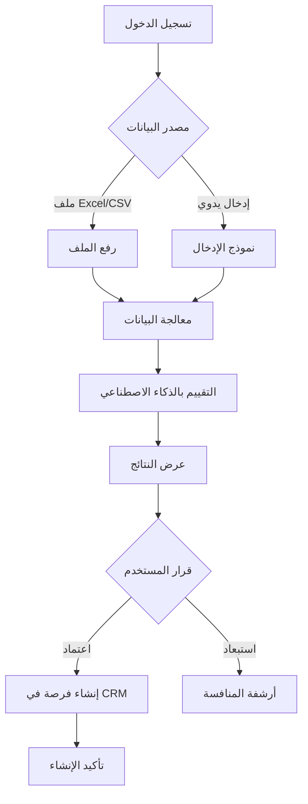

# Product Requirements Document (PRD)
# Etmaam CRM Integration Tool - "علاقات العملاء"

**Version:** 1.0  
**Date:** January 24, 2026  
**Author:** AI-Synthesized Analysis  
**Competition:** Infratech MVP Challenge (20,000 SAR Prize)  
**Timeline:** 30 Days from Launch

---

## Executive Summary

This PRD defines **Etmaam CRM Connector** - an intelligent tool that automates the entire workflow from Etimad tender discovery → AI qualification → CRM opportunity creation. The design follows a **phased approach**: MVP for the tournament, then expansion to a public SaaS product.

### Multi-Modal Analysis Summary

| Approach | Focus | Pros | Cons | Tournament Fit |
|----------|-------|------|------|----------------|
| **A: Tournament MVP** | Minimal viable flow | Fast build, proves concept | Limited expansion | ✅ Primary |
| **B: Single CRM** | HubSpot/Salesforce only | Deep integration | Vendor lock-in | ⚠️ Secondary |
| **C: Provider-Agnostic** | Abstract connector | Maximum flexibility | Complex architecture | 🔄 Post-MVP |
| **D: Multi-Provider** | Top 5 CRMs built-in | Wide market | Development heavy | 🔄 Post-MVP |

### Final Strategy: **Hybrid MVP + Extensible Architecture**

Build a working MVP that wins the tournament with a **provider-agnostic core architecture** that enables rapid expansion to multiple CRMs post-competition.

---

## 1. Problem Statement

### Current Pain Points (from Competition Brief)

الزملاء في انفراتك واكسوتك يواجهون:

1. **Manual Tender Discovery**: Checking Etimad platform daily, missing opportunities
2. **No Qualification Intelligence**: No systematic scoring or evaluation
3. **CRM Data Entry Gap**: Manual copy-paste from Etimad → CRM (الجهة، عنوان المنافسة، رقم المنافسة، الموعد النهائي، قيمة تقديرية)
4. **Lost Recommendations**: No audit trail of why tenders were pursued/rejected

### Market Context (from SWOT Analysis)

- **TAM**: $2-13M Saudi tender intelligence market
- **Competition**: TendersAlerts (4.3/10 moat), Esdaar (AI matching), SADARA AI (vertical integration)
- **Gap**: No tool offers **end-to-end Etimad → CRM automation** in Arabic-first UI

---

## 2. Solution Architecture

### 2.1 Core Value Proposition

> "من اعتماد إلى CRM في ثوانٍ - تقييم ذكي وإنشاء فرص تلقائي"
> 
> "From Etimad to CRM in seconds - intelligent evaluation and automatic opportunity creation"

### 2.2 System Architecture (Provider-Agnostic Design)

```
┌─────────────────────────────────────────────────────────────────┐
│                        ETMAAM CRM CONNECTOR                      │
├─────────────────────────────────────────────────────────────────┤
│                                                                  │
│  ┌──────────────┐    ┌──────────────┐    ┌──────────────────┐   │
│  │   INPUT      │    │   ENGINE     │    │   OUTPUT         │   │
│  │   LAYER      │───▶│   LAYER      │───▶│   LAYER          │   │
│  └──────────────┘    └──────────────┘    └──────────────────┘   │
│                                                                  │
│  • Etimad Portal     • AI Evaluator      • CRM Adapter          │
│  • CSV/Excel Upload  • Score Calculator  │ ├─ HubSpot          │
│  • API Integration   • Risk Analyzer     │ ├─ Salesforce       │
│                      • Recommendation    │ ├─ Zoho             │
│                        Generator         │ ├─ Odoo             │
│                                          │ └─ Custom Webhook   │
└─────────────────────────────────────────────────────────────────┘
```

### 2.3 Provider-Agnostic CRM Interface

```typescript
// Core abstraction for CRM integration
interface CRMProvider {
  id: string;
  name: string;
  nameAr: string;
  connect(credentials: CRMCredentials): Promise<ConnectionResult>;
  createOpportunity(data: OpportunityData): Promise<OpportunityResult>;
  updateOpportunity(id: string, data: Partial<OpportunityData>): Promise<OpportunityResult>;
  testConnection(): Promise<boolean>;
}

// Opportunity data mapped to CRM fields
interface OpportunityData {
  // Required fields (from competition requirements)
  entity: string;              // الجهة
  tenderTitle: string;         // عنوان المنافسة
  tenderNumber: string;        // رقم المنافسة
  deadline: Date;              // الموعد النهائي
  estimatedValue: number;      // قيمة تقديرية
  qualificationScore: number;  // درجة التقييم
  recommendation: string;      // التوصية
  
  // Extended fields
  riskLevel: 'low' | 'medium' | 'high';
  aiSummary: string;
  missingDocuments: string[];
  source: 'etimad' | 'excel' | 'csv' | 'api';
  originalUrl?: string;
}
```

---

## 3. MVP Feature Specification (Tournament Focus)

### 3.1 Must-Have Features (P0 - Required for Competition)

| Feature | Arabic Name | Description | Competition Requirement |
|---------|-------------|-------------|------------------------|
| **Data Input** | إدخال البيانات | Accept Excel/CSV or manual entry | ✅ "ملف مصدر مثل Excel أو CSV" |
| **AI Evaluation** | التقييم الذكي | Score 0-100 with brief reasons | ✅ "درجة من 0 إلى 100 مع أسباب مختصرة" |
| **CRM Push** | إنشاء فرصة | Create opportunity record in CRM | ✅ "إنشاء فرصة في الـ CRM تلقائيًا" |
| **Dashboard** | لوحة التحكم | Display tenders and evaluation results | ✅ "شاشة بسيطة لعرض المنافسات" |
| **Security** | حماية البيانات | Credential protection | ✅ "حماية بيانات الدخول" |

### 3.2 MVP User Flow



### 3.3 Data Fields Mapping

| Etimad Field | Arabic | CRM Field | Type | Required |
|--------------|--------|-----------|------|----------|
| Government Entity | الجهة | Account/Company | Text | ✅ |
| Tender Title | عنوان المنافسة | Opportunity Name | Text | ✅ |
| Reference Number | رقم المنافسة | Reference ID | Text | ✅ |
| Closing Date | الموعد النهائي | Close Date | Date | ✅ |
| Estimated Value | قيمة تقديرية | Amount | Currency | ✅ |
| AI Score | درجة التقييم | Score (Custom) | Number | ✅ |
| Recommendation | التوصية | Notes | Text | ✅ |
| Risk Level | مستوى المخاطر | Risk (Custom) | Picklist | ⚪ |
| AI Summary | ملخص الذكاء الاصطناعي | Description | Long Text | ⚪ |

---

## 4. AI Evaluation Engine

### 4.1 Scoring Model (Simple, Adjustable - Per Competition Requirements)

```typescript
interface EvaluationCriteria {
  // Budget alignment (30 points)
  budgetFit: {
    weight: 30;
    factors: ['minimum_capital_requirement', 'estimated_value_range'];
  };
  
  // Technical capability (25 points)
  technicalFit: {
    weight: 25;
    factors: ['activity_match', 'classification_grade', 'past_experience'];
  };
  
  // Timeline feasibility (20 points)
  timelineFit: {
    weight: 20;
    factors: ['submission_deadline', 'project_duration', 'resource_availability'];
  };
  
  // Strategic alignment (15 points)
  strategicFit: {
    weight: 15;
    factors: ['entity_relationship', 'sector_priority', 'geographic_preference'];
  };
  
  // Risk assessment (10 points)
  riskScore: {
    weight: 10;
    factors: ['competition_level', 'requirements_clarity', 'payment_terms'];
  };
}
```

### 4.2 AI Prompt Template (Arabic-Native)

```text
أنت خبير تقييم منافسات حكومية سعودية. قم بتحليل هذه المنافسة وأعطني:

معلومات المنافسة:
- العنوان: {{title}}
- الجهة: {{entity}}
- القيمة التقديرية: {{value}} ريال
- الموعد النهائي: {{deadline}}
- الوصف: {{description}}

ملف الشركة:
- التصنيف: {{classification}}
- الأنشطة: {{activities}}
- الخبرات السابقة: {{experience}}

المخرجات المطلوبة (JSON):
{
  "score": 0-100,
  "recommendation": "مؤهل" | "مؤهل بشروط" | "مستبعد",
  "summary_ar": "ملخص في 2-3 جمل",
  "strengths": ["نقاط القوة"],
  "risks": ["المخاطر"],
  "missing_requirements": ["المتطلبات الناقصة"],
  "action_items": ["الخطوات المقترحة"]
}
```

### 4.3 Evaluation Output Example

```json
{
  "tender_id": "TENDER-2026-001234",
  "evaluation": {
    "score": 78,
    "recommendation": "مؤهل",
    "summary_ar": "منافسة واعدة في مجال تقنية المعلومات مع جهة حكومية ذات تاريخ دفع جيد. القيمة التقديرية تتناسب مع قدرات الشركة ولكن الموعد النهائي قريب.",
    "breakdown": {
      "budget_fit": 28,
      "technical_fit": 22,
      "timeline_fit": 14,
      "strategic_fit": 10,
      "risk_score": 4
    },
    "strengths": [
      "تطابق عالي مع أنشطة الشركة",
      "جهة حكومية موثوقة",
      "قيمة مناسبة للقدرات"
    ],
    "risks": [
      "موعد التقديم خلال 10 أيام فقط",
      "متطلبات ضمان بنكي 5%"
    ],
    "missing_requirements": [
      "شهادة ISO 27001 (موصى بها)"
    ],
    "action_items": [
      "البدء فوراً بإعداد الوثائق",
      "التواصل مع البنك للضمان",
      "مراجعة المواصفات الفنية"
    ]
  },
  "metadata": {
    "evaluated_at": "2026-01-24T10:30:00Z",
    "model_version": "1.0",
    "confidence": 0.85
  }
}
```

---

## 5. CRM Integration Layer

### 5.1 MVP CRM Strategy

For the tournament, we implement **two integration paths**:

1. **Webhook/API (Universal)**: Works with any CRM that accepts webhooks
2. **Native HubSpot**: Deep integration for demonstration

### 5.2 CRM Provider Implementations

#### Option A: Webhook/Universal (MVP Default)

```typescript
// lib/crm/providers/webhook.ts
export class WebhookCRMProvider implements CRMProvider {
  id = 'webhook';
  name = 'Webhook (Universal)';
  nameAr = 'رابط ويب (عام)';
  
  async createOpportunity(data: OpportunityData): Promise<OpportunityResult> {
    const response = await fetch(this.config.webhookUrl, {
      method: 'POST',
      headers: {
        'Content-Type': 'application/json',
        'Authorization': `Bearer ${this.config.apiKey}`,
      },
      body: JSON.stringify({
        // Map to CRM-agnostic format
        opportunity: {
          name: `${data.tenderTitle} - ${data.tenderNumber}`,
          company: data.entity,
          amount: data.estimatedValue,
          close_date: data.deadline.toISOString(),
          stage: 'Qualification',
          custom_fields: {
            tender_number: data.tenderNumber,
            ai_score: data.qualificationScore,
            recommendation: data.recommendation,
            risk_level: data.riskLevel,
            ai_summary: data.aiSummary,
          }
        }
      })
    });
    
    return this.parseResponse(response);
  }
}
```

#### Option B: HubSpot Native

```typescript
// lib/crm/providers/hubspot.ts
export class HubSpotCRMProvider implements CRMProvider {
  id = 'hubspot';
  name = 'HubSpot CRM';
  nameAr = 'هاب سبوت';
  
  private client: Client;
  
  async connect(credentials: CRMCredentials): Promise<ConnectionResult> {
    this.client = new Client({ accessToken: credentials.apiKey });
    return { success: true, provider: this.id };
  }
  
  async createOpportunity(data: OpportunityData): Promise<OpportunityResult> {
    // Create or find company
    const company = await this.findOrCreateCompany(data.entity);
    
    // Create deal
    const deal = await this.client.crm.deals.basicApi.create({
      properties: {
        dealname: `${data.tenderTitle} - ${data.tenderNumber}`,
        amount: data.estimatedValue.toString(),
        closedate: data.deadline.toISOString(),
        dealstage: 'qualifiedtobuy',
        pipeline: 'default',
        // Custom properties
        tender_reference: data.tenderNumber,
        ai_qualification_score: data.qualificationScore.toString(),
        ai_recommendation: data.recommendation,
        risk_level: data.riskLevel,
        tender_summary: data.aiSummary,
      },
      associations: [
        {
          to: { id: company.id },
          types: [{ associationCategory: 'HUBSPOT_DEFINED', associationTypeId: 5 }]
        }
      ]
    });
    
    return {
      success: true,
      crmId: deal.id,
      crmUrl: `https://app.hubspot.com/contacts/${this.portalId}/deal/${deal.id}`
    };
  }
}
```

#### Option C: Salesforce Native

```typescript
// lib/crm/providers/salesforce.ts
export class SalesforceCRMProvider implements CRMProvider {
  id = 'salesforce';
  name = 'Salesforce';
  nameAr = 'سيلز فورس';
  
  async createOpportunity(data: OpportunityData): Promise<OpportunityResult> {
    // Find or create Account
    const account = await this.conn.sobject('Account').findOrCreate({
      Name: data.entity
    }, { Name: data.entity, Type: 'Government' });
    
    // Create Opportunity
    const opportunity = await this.conn.sobject('Opportunity').create({
      Name: `${data.tenderTitle} - ${data.tenderNumber}`,
      AccountId: account.Id,
      Amount: data.estimatedValue,
      CloseDate: formatDate(data.deadline),
      StageName: 'Qualification',
      // Custom fields
      Tender_Reference__c: data.tenderNumber,
      AI_Score__c: data.qualificationScore,
      AI_Recommendation__c: data.recommendation,
      Risk_Level__c: data.riskLevel,
      Description: data.aiSummary,
    });
    
    return {
      success: true,
      crmId: opportunity.id,
      crmUrl: `${this.instanceUrl}/${opportunity.id}`
    };
  }
}
```

### 5.3 CRM Factory Pattern

```typescript
// lib/crm/factory.ts
export class CRMProviderFactory {
  private static providers: Map<string, CRMProvider> = new Map([
    ['webhook', new WebhookCRMProvider()],
    ['hubspot', new HubSpotCRMProvider()],
    ['salesforce', new SalesforceCRMProvider()],
    ['zoho', new ZohoCRMProvider()],
    ['odoo', new OdooCRMProvider()],
  ]);
  
  static getProvider(type: string): CRMProvider {
    const provider = this.providers.get(type);
    if (!provider) {
      throw new Error(`CRM provider '${type}' not found`);
    }
    return provider;
  }
  
  static listProviders(): ProviderInfo[] {
    return Array.from(this.providers.values()).map(p => ({
      id: p.id,
      name: p.name,
      nameAr: p.nameAr,
    }));
  }
}
```

---

## 6. Database Schema

### 6.1 Core Tables

```sql
-- Tenders table (source data)
CREATE TABLE tenders (
  id UUID PRIMARY KEY DEFAULT gen_random_uuid(),
  user_id UUID REFERENCES auth.users NOT NULL,
  
  -- Source info
  source TEXT NOT NULL CHECK (source IN ('etimad', 'excel', 'csv', 'manual')),
  source_url TEXT,
  
  -- Tender data (Arabic-first)
  title_ar TEXT NOT NULL,
  title_en TEXT,
  entity_ar TEXT NOT NULL,
  entity_en TEXT,
  reference_no TEXT,
  description_ar TEXT,
  description_en TEXT,
  estimated_value DECIMAL(15,2),
  submission_deadline TIMESTAMPTZ,
  
  -- Status
  status TEXT DEFAULT 'pending' CHECK (status IN ('pending', 'evaluating', 'evaluated', 'approved', 'pushed', 'rejected')),
  
  -- Timestamps
  created_at TIMESTAMPTZ DEFAULT NOW(),
  updated_at TIMESTAMPTZ DEFAULT NOW()
);

-- Evaluations table (AI results)
CREATE TABLE evaluations (
  id UUID PRIMARY KEY DEFAULT gen_random_uuid(),
  tender_id UUID REFERENCES tenders(id) ON DELETE CASCADE NOT NULL,
  user_id UUID REFERENCES auth.users NOT NULL,
  
  -- AI Evaluation
  score INTEGER CHECK (score >= 0 AND score <= 100),
  recommendation TEXT CHECK (recommendation IN ('qualified', 'conditional', 'excluded')),
  recommendation_ar TEXT,
  summary_ar TEXT,
  summary_en TEXT,
  
  -- Breakdown
  budget_fit_score INTEGER,
  technical_fit_score INTEGER,
  timeline_fit_score INTEGER,
  strategic_fit_score INTEGER,
  risk_score INTEGER,
  
  -- Lists (JSONB)
  strengths JSONB DEFAULT '[]'::jsonb,
  risks JSONB DEFAULT '[]'::jsonb,
  missing_requirements JSONB DEFAULT '[]'::jsonb,
  action_items JSONB DEFAULT '[]'::jsonb,
  
  -- Metadata
  model_version TEXT DEFAULT '1.0',
  confidence DECIMAL(3,2),
  evaluated_at TIMESTAMPTZ DEFAULT NOW(),
  
  created_at TIMESTAMPTZ DEFAULT NOW()
);

-- CRM Connections table
CREATE TABLE crm_connections (
  id UUID PRIMARY KEY DEFAULT gen_random_uuid(),
  user_id UUID REFERENCES auth.users NOT NULL,
  
  -- Provider info
  provider TEXT NOT NULL,
  provider_name TEXT NOT NULL,
  
  -- Credentials (encrypted at rest via Supabase Vault)
  credentials_encrypted BYTEA NOT NULL,
  
  -- Connection status
  is_active BOOLEAN DEFAULT true,
  last_tested_at TIMESTAMPTZ,
  test_result TEXT,
  
  created_at TIMESTAMPTZ DEFAULT NOW(),
  updated_at TIMESTAMPTZ DEFAULT NOW(),
  
  UNIQUE(user_id, provider)
);

-- CRM Opportunities table (pushed records)
CREATE TABLE crm_opportunities (
  id UUID PRIMARY KEY DEFAULT gen_random_uuid(),
  tender_id UUID REFERENCES tenders(id) ON DELETE CASCADE NOT NULL,
  evaluation_id UUID REFERENCES evaluations(id),
  user_id UUID REFERENCES auth.users NOT NULL,
  crm_connection_id UUID REFERENCES crm_connections(id) NOT NULL,
  
  -- CRM reference
  crm_id TEXT NOT NULL,
  crm_url TEXT,
  
  -- Sync status
  sync_status TEXT DEFAULT 'synced' CHECK (sync_status IN ('synced', 'pending', 'failed')),
  last_sync_at TIMESTAMPTZ DEFAULT NOW(),
  sync_error TEXT,
  
  created_at TIMESTAMPTZ DEFAULT NOW()
);

-- Enable RLS on all tables
ALTER TABLE tenders ENABLE ROW LEVEL SECURITY;
ALTER TABLE evaluations ENABLE ROW LEVEL SECURITY;
ALTER TABLE crm_connections ENABLE ROW LEVEL SECURITY;
ALTER TABLE crm_opportunities ENABLE ROW LEVEL SECURITY;

-- RLS Policies (users can only access their own data)
CREATE POLICY "Users can manage own tenders" ON tenders
  FOR ALL TO authenticated USING (auth.uid() = user_id);

CREATE POLICY "Users can manage own evaluations" ON evaluations
  FOR ALL TO authenticated USING (auth.uid() = user_id);

CREATE POLICY "Users can manage own connections" ON crm_connections
  FOR ALL TO authenticated USING (auth.uid() = user_id);

CREATE POLICY "Users can manage own opportunities" ON crm_opportunities
  FOR ALL TO authenticated USING (auth.uid() = user_id);
```

### 6.2 Indexes

```sql
-- Performance indexes
CREATE INDEX idx_tenders_user_status ON tenders(user_id, status);
CREATE INDEX idx_tenders_deadline ON tenders(submission_deadline DESC);
CREATE INDEX idx_evaluations_tender ON evaluations(tender_id);
CREATE INDEX idx_evaluations_score ON evaluations(score DESC);
CREATE INDEX idx_crm_opportunities_tender ON crm_opportunities(tender_id);
```

---

## 7. UI/UX Specification

### 7.1 Design System (Arabic-First)

| Component | Light Mode | Dark Mode |
|-----------|------------|-----------|
| Background | `#ffffff` | `#0f172a` |
| Primary | `#10b981` (Emerald) | `#34d399` |
| Text | `#1e293b` | `#e2e8f0` |
| Success | `#22c55e` | `#4ade80` |
| Warning | `#f59e0b` | `#fbbf24` |
| Danger | `#ef4444` | `#f87171` |
| Direction | RTL | RTL |
| Font | IBM Plex Sans Arabic | IBM Plex Sans Arabic |

### 7.2 Key Screens

#### A. Dashboard (لوحة التحكم)

```
┌─────────────────────────────────────────────────────────────────┐
│  إتمام | علاقات العملاء                     🌙 [حسابي] [خروج]  │
├─────────────────────────────────────────────────────────────────┤
│                                                                  │
│  ┌──────────┐ ┌──────────┐ ┌──────────┐ ┌──────────┐           │
│  │    15    │ │    12    │ │     3    │ │  2.5M    │           │
│  │ المنافسات│ │  مؤهلة   │ │ مستبعدة  │ │ القيمة   │           │
│  └──────────┘ └──────────┘ └──────────┘ └──────────┘           │
│                                                                  │
│  ┌────────────────────────────────────────────────────────────┐ │
│  │  [رفع ملف Excel/CSV]              [+ إضافة منافسة يدوياً]  │ │
│  └────────────────────────────────────────────────────────────┘ │
│                                                                  │
│  ┌────────────────────────────────────────────────────────────┐ │
│  │ المنافسة              │ الجهة    │ التقييم │ الحالة │       │ │
│  ├────────────────────────────────────────────────────────────┤ │
│  │ مشروع تقنية معلومات   │ وزارة X  │  85/100 │ مؤهل  │ [👁] │ │
│  │ صيانة شبكات          │ جامعة Y  │  62/100 │ مشروط │ [👁] │ │
│  │ توريد أجهزة          │ مستشفى Z │  35/100 │ مستبعد│ [👁] │ │
│  └────────────────────────────────────────────────────────────┘ │
│                                                                  │
└─────────────────────────────────────────────────────────────────┘
```

#### B. Tender Detail (تفاصيل المنافسة)

```
┌─────────────────────────────────────────────────────────────────┐
│  ← عودة                       مشروع تقنية المعلومات #12345      │
├─────────────────────────────────────────────────────────────────┤
│                                                                  │
│  ┌──────────────────────────────┬───────────────────────────┐   │
│  │       معلومات المنافسة       │       تقييم الذكاء       │   │
│  ├──────────────────────────────┼───────────────────────────┤   │
│  │ الجهة: وزارة الصحة           │                           │   │
│  │ الرقم: TENDER-2026-12345    │      ┌────────────┐       │   │
│  │ القيمة: 2,500,000 ر.س       │      │    85     │       │   │
│  │ الموعد: 2026-02-15          │      │   /100    │       │   │
│  │                              │      └────────────┘       │   │
│  │                              │                           │   │
│  │                              │   التوصية: ✅ مؤهل        │   │
│  └──────────────────────────────┴───────────────────────────┘   │
│                                                                  │
│  ┌────────────────────────────────────────────────────────────┐ │
│  │ 📊 تفصيل التقييم                                           │ │
│  ├────────────────────────────────────────────────────────────┤ │
│  │ الملاءمة المالية   ████████████████████░░░  28/30         │ │
│  │ التوافق الفني     ████████████████░░░░░░░  22/25         │ │
│  │ الجدول الزمني     ████████████░░░░░░░░░░░  14/20         │ │
│  │ التوافق الاستراتيجي█████████████░░░░░░░░░  10/15         │ │
│  │ تقييم المخاطر     █████████████████████░░  11/10         │ │
│  └────────────────────────────────────────────────────────────┘ │
│                                                                  │
│  ┌────────────────────────────────────────────────────────────┐ │
│  │ 💡 ملخص الذكاء الاصطناعي                                   │ │
│  │                                                             │ │
│  │ منافسة واعدة في مجال تقنية المعلومات مع جهة حكومية ذات     │ │
│  │ تاريخ دفع جيد. القيمة التقديرية تتناسب مع قدرات الشركة    │ │
│  │ ولكن الموعد النهائي قريب.                                  │ │
│  └────────────────────────────────────────────────────────────┘ │
│                                                                  │
│  ┌────────────────────────────────────────────────────────────┐ │
│  │         [❌ استبعاد]        [✅ اعتماد وإنشاء فرصة CRM]    │ │
│  └────────────────────────────────────────────────────────────┘ │
│                                                                  │
└─────────────────────────────────────────────────────────────────┘
```

#### C. CRM Settings (إعدادات CRM)

```
┌─────────────────────────────────────────────────────────────────┐
│  إعدادات الربط مع أنظمة علاقات العملاء                          │
├─────────────────────────────────────────────────────────────────┤
│                                                                  │
│  ┌─────────────────────────────────────────────────────────┐    │
│  │ اختر نظام CRM:                                          │    │
│  │                                                          │    │
│  │  ○ HubSpot     ○ Salesforce    ○ Zoho                  │    │
│  │  ○ Odoo        ● Webhook (عام)                         │    │
│  │                                                          │    │
│  └─────────────────────────────────────────────────────────┘    │
│                                                                  │
│  ┌─────────────────────────────────────────────────────────┐    │
│  │ إعدادات Webhook:                                        │    │
│  │                                                          │    │
│  │ رابط الـ Webhook:                                       │    │
│  │ ┌─────────────────────────────────────────────────────┐ │    │
│  │ │ https://your-crm.com/api/webhook/opportunities     │ │    │
│  │ └─────────────────────────────────────────────────────┘ │    │
│  │                                                          │    │
│  │ مفتاح API:                                              │    │
│  │ ┌─────────────────────────────────────────────────────┐ │    │
│  │ │ sk_live_xxxxxxxxxxxxxxxxxxxx                       │ │    │
│  │ └─────────────────────────────────────────────────────┘ │    │
│  │                                                          │    │
│  │     [🔄 اختبار الاتصال]           [💾 حفظ الإعدادات]     │    │
│  └─────────────────────────────────────────────────────────┘    │
│                                                                  │
│  ┌─────────────────────────────────────────────────────────┐    │
│  │ ✅ تم الاتصال بنجاح | آخر اختبار: قبل 5 دقائق           │    │
│  └─────────────────────────────────────────────────────────┘    │
│                                                                  │
└─────────────────────────────────────────────────────────────────┘
```

---

## 8. Technical Requirements

### 8.1 Tech Stack (Frozen)

| Layer | Technology | Version | Rationale |
|-------|------------|---------|-----------|
| Framework | Next.js | 16.1.4 | App Router, Server Actions |
| Language | TypeScript | 5.7+ | Strict mode |
| Styling | Tailwind CSS | 4.0 | Native RTL support |
| UI Components | Shadcn/UI | Latest | Accessible, customizable |
| Database | Supabase | SSR Package | RLS, Real-time |
| AI | Vercel AI SDK | 4.x | Streaming JSON |
| i18n | next-intl | Latest | App Router optimized |
| Icons | Lucide React | Latest | Consistent design |
| Font | IBM Plex Sans Arabic | Google Fonts | Arabic-native |

### 8.2 File Structure

```
app/
├── [locale]/
│   ├── layout.tsx              # Root layout (RTL, theme)
│   ├── page.tsx                # Landing/login
│   ├── dashboard/
│   │   ├── page.tsx            # Main dashboard
│   │   ├── loading.tsx         # Skeleton loader
│   │   └── [tenderId]/
│   │       └── page.tsx        # Tender detail
│   └── settings/
│       ├── page.tsx            # General settings
│       └── crm/
│           └── page.tsx        # CRM configuration
├── api/
│   └── webhooks/
│       └── crm/route.ts        # Webhook handlers
actions/
├── tender-actions.ts           # Tender CRUD
├── evaluation-actions.ts       # AI evaluation
└── crm-actions.ts              # CRM operations
components/
├── ui/                         # Shadcn components
├── dashboard/
│   ├── stats-cards.tsx
│   ├── tender-table.tsx
│   └── file-uploader.tsx
├── tender/
│   ├── detail-view.tsx
│   ├── evaluation-display.tsx
│   └── crm-push-dialog.tsx
└── settings/
    └── crm-config-form.tsx
lib/
├── supabase/
│   ├── server.ts
│   └── client.ts
├── ai/
│   ├── evaluator.ts
│   └── prompts.ts
├── crm/
│   ├── factory.ts
│   ├── types.ts
│   └── providers/
│       ├── webhook.ts
│       ├── hubspot.ts
│       ├── salesforce.ts
│       └── zoho.ts
└── utils/
    ├── file-parser.ts          # Excel/CSV parsing
    └── validators.ts           # Zod schemas
types/
├── supabase.ts                 # Generated types
├── tender.ts
├── evaluation.ts
└── crm.ts
messages/
├── ar.json                     # Arabic translations
└── en.json                     # English translations
```

### 8.3 Security Requirements

| Requirement | Implementation | Priority |
|-------------|----------------|----------|
| Credential Encryption | Supabase Vault | P0 |
| API Key Storage | Server-only, never client | P0 |
| Input Validation | Zod schemas | P0 |
| RLS Policies | All tables | P0 |
| HTTPS | Enforced via Vercel | P0 |
| Session Management | Supabase Auth | P0 |

---

## 9. Success Criteria (Competition)

### 9.1 Required Deliverables (from Brief)

| Requirement | Arabic | Acceptance Criteria |
|-------------|--------|---------------------|
| Working E2E Flow | سير إجراءات يعمل | Upload → Evaluate → CRM Push works |
| Easy to Operate | سهولة التشغيل | < 5 minutes to understand |
| Adjustable Logic | منطق تقييم قابل للتعديل | Can modify scoring weights |
| Clear Documentation | توثيق واضح | README + video demo |
| Basic Security | حماية بيانات الدخول | Credentials encrypted |

### 9.2 Evaluation Weights (Inferred)

| Criterion | Weight | How to Excel |
|-----------|--------|--------------|
| Functionality | 40% | Complete E2E flow |
| UX/UI | 25% | Arabic-first, polished |
| Code Quality | 15% | Clean, documented |
| Innovation | 10% | AI evaluation depth |
| Documentation | 10% | Setup guide, video |

---

## 10. Post-MVP Roadmap

### Phase 2: Public Beta (Month 2-3)

- [ ] Multi-tenant architecture
- [ ] Additional CRM providers (Zoho, Odoo, Pipedrive)
- [ ] Etimad API integration (when available)
- [ ] Team collaboration features
- [ ] API access for developers

### Phase 3: Scale (Month 4-6)

- [ ] AI semantic search (NLP matching)
- [ ] Win probability ML model
- [ ] Price benchmarking (market intelligence)
- [ ] WhatsApp/Telegram alerts
- [ ] Mobile app (PWA)

### Phase 4: Enterprise (Month 7-12)

- [ ] SSO (SAML/OAuth)
- [ ] RBAC (role-based access)
- [ ] Enterprise SLA (99.9% uptime)
- [ ] Official Etimad partnership
- [ ] White-label reseller program

---

## Appendix A: CRM Field Mapping Reference

### HubSpot Field Mapping

| Etmaam Field | HubSpot Property | Type |
|--------------|------------------|------|
| tenderTitle | dealname | String |
| estimatedValue | amount | Number |
| deadline | closedate | Date |
| entity | associations.company | Association |
| qualificationScore | ai_qualification_score* | Number |
| recommendation | ai_recommendation* | Enum |
| riskLevel | risk_level* | Enum |
| aiSummary | tender_summary* | Long Text |

*Custom properties to create

### Salesforce Field Mapping

| Etmaam Field | Salesforce Field | Type |
|--------------|------------------|------|
| tenderTitle | Name | String |
| estimatedValue | Amount | Currency |
| deadline | CloseDate | Date |
| entity | AccountId | Lookup |
| qualificationScore | AI_Score__c* | Number |
| recommendation | AI_Recommendation__c* | Picklist |
| riskLevel | Risk_Level__c* | Picklist |
| aiSummary | Description | Long Text |

*Custom fields to create

---

## Appendix B: Arabic Terminology Reference

| English | Arabic | Usage |
|---------|--------|-------|
| Tender | منافسة | Primary term |
| Qualification | تأهيل | AI evaluation |
| Score | درجة | Numeric rating |
| Recommendation | توصية | AI suggestion |
| Qualified | مؤهل | Green status |
| Excluded | مستبعد | Red status |
| Conditional | مشروط | Yellow status |
| Entity | جهة | Government body |
| Deadline | الموعد النهائي | Submission date |
| Estimated Value | قيمة تقديرية | Budget |
| Opportunity | فرصة | CRM record |
| CRM | نظام علاقات العملاء | CRM system |

---

**Document End**

*This PRD was synthesized from multiple analytical approaches to optimize for tournament success while enabling future scalability.*
