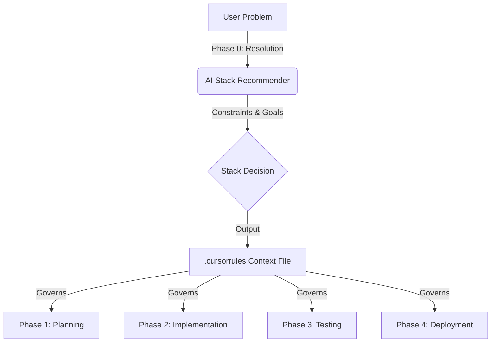

# The "Stack-Agnostic" AI Development Workflow (Verified 2026)

This reusable framework replaces hardcoded tech stacks with an intelligent **Phase 0: Resolution Engine** that dynamically configures the entire development lifecycle based on your specific problem. It is designed to work with **any** modern stack (Python, Node, Go, Rust) while maintaining the 5 pillars of quality.

***

## **Visualizing the Dynamic Workflow**

The core innovation is **The Context Bridge**. Instead of just starting to code, we first force the AI to "resolve" the best tools for the job and freeze those decisions into a configuration file (`.cursorrules`) that governs all subsequent stages.




***

## **PHASE 0: INTELLIGENT STACK SELECTION (The New Foundation)**

**Goal**: Scientifically select the optimal tech stack and generate the "Context Bridge" file.

### **Step 0.1: Problem-to-Stack Resolution**

**Prompt Strategy**: Use a "Constraint-Satisfaction" prompt instead of a generic "What should I use?" prompt.

**Copy-Paste Prompt:**

```text
Act as a Principal Software Architect. I need to build a solution for [PROBLEM DESCRIPTION]. 

Analyze the following constraints:
1. Team Size: [e.g., Solo Founder / 5-person team]
2. Expected Scale: [e.g., MVP / 1M users]
3. Budget: [e.g., $0 start / Enterprise]
4. Performance Needs: [e.g., Real-time / Static content]
5. My Current Expertise: [e.g., JavaScript / Python]

Recommend the optimal tech stack (Frontend, Backend, DB, Auth, Infra) based on:
- "AI Proficiency" (How well AI models can generate code for it [arXiv:2509.11132])
- Ecosystem Maturity (LTS support as of Jan 2026)
- Speed to Market vs. Scalability trade-off

Output a JSON object with keys: `frontend`, `backend`, `database`, `auth`, `testing_framework`, `deployment_target`.
```


### **Step 0.2: Verification Matrix**

**AI Action**: Ask the AI to verify compatibility between selected components.
**Prompt**: *"Create a compatibility matrix for the selected stack. Verify that [Frontend Library] version X is compatible with [Backend Framework] version Y. Check for any 'breaking changes' released in late 2025/early 2026."*

### **Step 0.3: Generating the Context Bridge (.cursorrules)**

Once the stack is confirmed, generate the dynamic rule file.

**Prompt**:

```text
Generate a .cursorrules file for this project using the selected stack:
Stack: [INSERT STACK FROM 0.1]

Include:
1. "tech_stack": [List specific versions]
2. "project_structure": [Best practice folder structure for this stack]
3. "naming_conventions": [Idiomatic casing for this language]
4. "testing_rules": [Specific syntax for the chosen test framework]
```


***

## **PHASE 1: DYNAMIC PLANNING**

**Governed by**: `.cursorrules` (defines *how* we plan)

### **1.1 Stack-Aware Specs**

Instead of generic specs, force AI to use stack-specific patterns defined in Phase 0.

* **Prompt**: *"Generate a technical spec. Since we are using {{BACKEND_FRAMEWORK}}, define the API using {{SPECIFIC_PATTERN}} (e.g., Pydantic models for FastAPI, Zod for Next.js)."*


### **1.2 Architecture Alignment**

* **Verification**: Ensure the proposed architecture matches the "AI Proficiency" findings.
* **Check**: *"Does this architecture use patterns that are well-documented in the training data for {{CHOSEN_STACK}}?"* (e.g., avoid obscure experimental features of Rust).

***

## **PHASE 2: ABSTRACTED IMPLEMENTATION**

We replace specific commands with **Abstract Actions** that the AI fills in based on Phase 0.

### **2.1 The "Schema-First" Action**

* **Concept**: Always define the data model before code.
* **Dynamic Command**: `{{ORM_MIGRATION_CMD}}`
    * *If Django*: `python manage.py makemigrations`
    * *If Prisma*: `npx prisma migrate`
    * *If Go/Gorm*: (Manual SQL or migration tool)
* **Protocol**: "Generate the data model file ({{SCHEMA_FILE}}), then stop. Do not write logic yet."


### **2.2 The "Interface Definition" Action**

* **Concept**: Define types/contracts before implementation.
* **Dynamic Command**: Generate `{{TYPE_DEFINITION_FILE}}`
    * *If TS*: `.ts` interfaces
    * *If Python*: `typing.TypedDict` or Pydantic models
    * *If Go*: `struct` definitions


### **2.3 The "Scoped Logic" Action**

* **Concept**: Implement logic wrapped in stack-specific error handling.
* **Prompt**: *"Implement the logic for [Feature] using {{ERROR_HANDLING_PATTERN}} defined in .cursorrules."*

***

## **PHASE 3: POLYGLOT TESTING**

**Governed by**: `testing_framework` key from Phase 0.

### **3.1 Dynamic Test Generation**

* **Prompt**: *"Generate unit tests using {{TESTING_FRAMEWORK}}. Mock external dependencies using {{MOCKING_LIBRARY}}."*
    * *Context*: If stack is Python, AI uses `pytest` + `pytest-mock`. If Node, `jest`.


### **3.2 Stack-Specific Security Audit**

* **Prompt**: *"Scan this code for top 5 security vulnerabilities specific to {{CHOSEN_LANGUAGE}}. (e.g., Prototype Pollution for JS, Pickle deserialization for Python)."*

***

## **PHASE 4: ADAPTIVE DEPLOYMENT**

### **4.1 Containerization (Universal Abstraction)**

* **Strategy**: Use Docker as the universal equalizer.
* **Prompt**: *"Generate a Dockerfile optimized for {{CHOSEN_STACK}}. Use multi-stage builds to minimize image size."*


### **4.2 CI/CD Generation**

* **Prompt**: *"Generate a GitHub Actions workflow that: 1. Installs {{LANGUAGE_RUNTIME}} 2. Runs {{TEST_COMMAND}} 3. Deploys to {{DEPLOYMENT_TARGET}}."*

***

## **Summary of the "Variables"**

To use this workflow, you simply fill in these variables during Phase 0:


| Variable | Description | Example (Next.js) | Example (Python) |
| :-- | :-- | :-- | :-- |
| `{{STACK}}` | The chosen technology | Next.js 16 | FastAPI |
| `{{ORM}}` | Data access layer | Prisma | SQLAlchemy |
| `{{TEST_FW}}` | Testing tool | Jest/Playwright | Pytest |
| `{{CONFIG_FILE}}` | Configuration context | `.cursorrules` | `.cursorrules` |
| `{{LINTER}}` | Code quality tool | ESLint | Ruff/Black |

## **How to Start a Project with this Workflow**

1. **Open Cursor**.
2. **Paste the Phase 0 Prompt** (Step 0.1 above) with your problem description.
3. **Review the Recommendation**: "AI suggests FastAPI + React + PostgreSQL".
4. **Accept \& Freeze**: Ask AI to "Generate the `.cursorrules` for this stack."
5. **Proceed**: Start Phase 1, referencing the now-frozen stack in every step.
<span style="display:none">[^1][^10][^11][^12][^13][^14][^15][^16][^17][^18][^19][^2][^20][^21][^22][^23][^24][^25][^26][^27][^28][^29][^3][^30][^31][^32][^33][^4][^5][^6][^7][^8][^9]</span>

<div align="center">⁂</div>

[^1]: https://arxiv.org/abs/2509.11132

[^2]: https://arxiv.org/abs/2508.05693

[^3]: https://arxiv.org/abs/2509.13144

[^4]: https://www.semanticscholar.org/paper/3ad9e5d9c8340a7dc7132d6e49d9bca457206c31

[^5]: https://www.spiedigitallibrary.org/conference-proceedings-of-spie/13687/3078485/LLMs-and-LVMs-for-agentic-AI--a-GPU-accelerated/10.1117/12.3078485.full

[^6]: https://arxiv.org/abs/2502.08756

[^7]: https://ijsrcseit.com/index.php/home/article/view/CSEIT24105457

[^8]: https://www.canjhealthtechnol.ca/index.php/cjht/article/view/OP0556

[^9]: https://www.scitepress.org/DigitalLibrary/Link.aspx?doi=10.5220/0012820600003753

[^10]: https://economics.kntu.kr.ua/eng/archive/12(45)/45_Dmytryshyn.html

[^11]: http://arxiv.org/pdf/2405.18369.pdf

[^12]: http://arxiv.org/pdf/2410.00880.pdf

[^13]: https://arxiv.org/html/2504.03975v1

[^14]: https://arxiv.org/pdf/2412.05127.pdf

[^15]: http://arxiv.org/pdf/2303.07839.pdf

[^16]: https://arxiv.org/pdf/2504.02052.pdf

[^17]: https://arxiv.org/pdf/2401.14079.pdf

[^18]: http://arxiv.org/pdf/2309.09128v3.pdf

[^19]: https://www.linkedin.com/pulse/mastering-ai-prompts-6-frameworks-boost-engineering-subrahmanyam-zcfwc

[^20]: https://dev.to/kevinc35/ai-the-future-of-software-engineering-advanced-prompting-techniques-for-10x-efficiency-2g2h

[^21]: https://kms-technology.com/blog/30-best-chatgpt-prompts-for-software-engineers/

[^22]: https://altersquare.io/5-ai-prompts-every-developer-should-master-copy-paste-ready/

[^23]: https://arxiv.org/html/2509.11132v1

[^24]: https://www.braintrust.dev/articles/systematic-prompt-engineering

[^25]: https://www.rickpollick.com/post/ai-generated-compatibility-matrix

[^26]: https://www.engify.ai/prompts/technology-selection-framework

[^27]: https://www.digitalocean.com/resources/articles/prompt-engineering-best-practices

[^28]: https://magai.co/ai-dependency-management-features-to-look-for/

[^29]: https://promptengineering.org/the-generative-ai-stack/

[^30]: https://help.openai.com/en/articles/6654000-best-practices-for-prompt-engineering-with-the-openai-api

[^31]: https://www.qatouch.com/blog/compatibility-testing/

[^32]: https://www.ibm.com/think/insights/top-ai-agent-frameworks

[^33]: https://www.promptingguide.ai/introduction/tips

